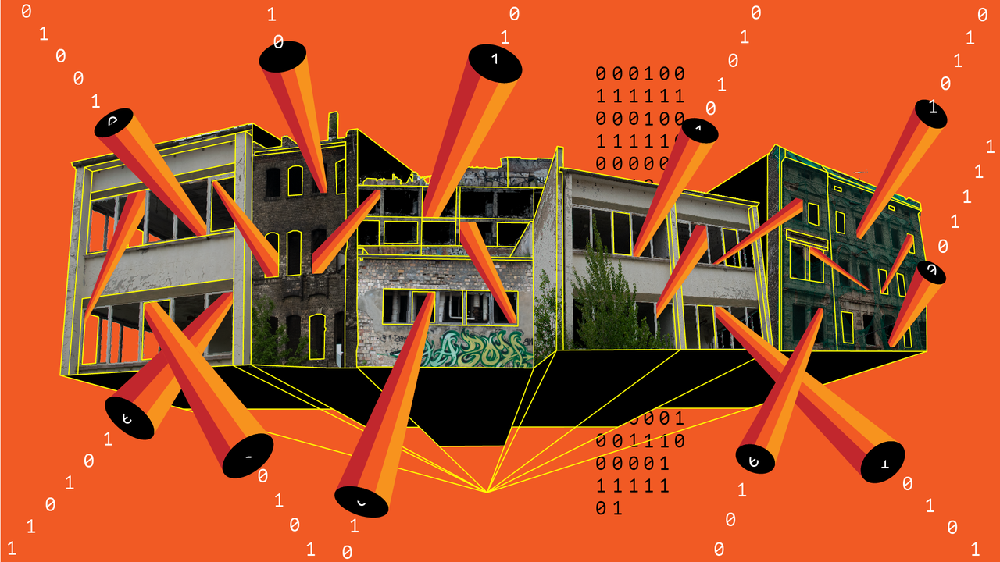
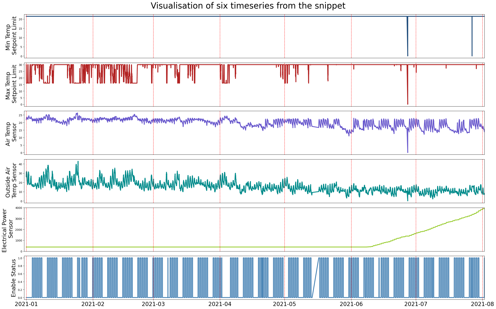

This repo is under construction.

# BTS: Building Timeseries Dataset



<a href="https://www.instagram.com/miss.tonton/">Anton Grabolle</a> / <a href="https://www.betterimagesofai.org">Better Images of AI</a> / AI Architecture / <a href="https://creativecommons.org/licenses/by/4.0/">Licenced by CC-BY 4.0</a></span>

**BTS: Building Timeseries Dataset: Empowering Large-Scale Building Analytics**. [[ArXiv](https://arxiv.org/abs/2406.08990)]

The Building TimeSeries (BTS) dataset covers three buildings over a three-year period, comprising more than ten thousand timeseries data points with hundreds of unique ontologies.
Moreover, the metadata is standardized using the Brick schema.

This is the primary repo to access the dataset.

**Acknowledgement**:
This is part of the NSW, Australia [Digital Infrastructure Energy Flexibility (DIEF)](https://research.csiro.au/dch/projects/nsw-dief/) project.

# Abstract

Buildings play a crucial role in human well-being, influencing occupant comfort, health, and safety.
Additionally, they contribute significantly to global energy consumption, accounting for one-third of total energy usage, and carbon emissions.
Optimizing building performance presents a vital opportunity to combat climate change and promote human flourishing.
However, research in building analytics has been hampered by the lack of accessible, available, and comprehensive real-world datasets on multiple building operations.
In this paper, we introduce the Building TimeSeries (BTS) dataset.
Our dataset covers three buildings over a three-year period, comprising more than ten thousand timeseries data points with hundreds of unique ontologies.
Moreover, the metadata is standardized using the Brick schema.
To demonstrate the utility of this dataset, we performed benchmarks on two tasks: timeseries ontology classification and zero-shot forecasting.
These tasks represent an essential initial step in addressing challenges related to interoperability in building analytics.
Access to the dataset and the code used for benchmarking are available here: https://github.com/cruiseresearchgroup/DIEF_BTS


# Dataset

View the [data card](https://sites.research.google/datacardsplaybook/) [here](BTS_DataCards.md).

## Snippet



For ease, we provided a very small snippet of the dataset: `DIEF_B_Snippet50_3weeks.pkl.zip`.
Only 50 timeseries, all from `Site B`, haphazardly selected.
This file is less than 10 MB, small enough to be sent as email attachment in most system.
Accompanied with it is a short code to extract and visualize the dataset: `DIEF_inspect_Snippet.ipynb`.

We also provided the building metadata `Site_B.ttl` in the form of a [Brick](https://brickschema.org/ontology/1.2) [turtle](https://www.w3.org/TR/turtle/) file.
Accompanied with it is a Brick definition file `Brick_v1.2.1.ttl` and a short code to extract the statistics: `DIEF_inspect_brick.ipynb`.
If you have not, you will need to install the [rdflib](https://rdflib.readthedocs.io) python package.

## Access

Access the training dataset on [FigShare](https://figshare.com/articles/dataset/BTS_Building_Timeseries_Dataset_Empowering_Large-Scale_Building_Analytics_TRAIN_ONLY_/25912180).

DOI: `10.6084/m9.figshare.25912180`

Note that, as of now, only the training data are made publicly available as we are planning to host a competition using this dataset. (Last update 2024 06 12)

## Files description

List of files available now:
* `train.zip` is the raw time series data. This is a zip of a folder of [`pickle`](https://docs.python.org/3/library/pickle.html) file. Inside each pickle file is a NumPy array with dimension [2,n] where `n` is the number of timesteps. The first row is the timestamp and the second row is the value.
* `Site_B.ttl` is the turtle file that contains the metadata of Site B using the [Brick schema](https://brickschema.org).
* `mapper_TrainOnly.csv` contains the information that maps the timeseries filenames in `train.zip` to the `StreamID` in `Site_B.ttl`. Some buildings in `train.zip` are from Site A and the brick schema is not yet made available. This is on purpose.
* `train_X.zip` and `train_Y.csv` are generated from `train.zip` using the function in the `xySplit.py` file.
* `train_Y.csv` see above.

The following files are missing and it is intentional:
* `trainAll_2006.pkl`
* `trainAll_5564.pkl`
* `trainAll_6224.pkl`
* `trainAll_6486.pkl`
* `train_X10579.pkl`
* `train_X22414.pkl`
* `train_X26831.pkl`
* `train_X14584.pkl`
* `train_X27109.pkl`
* `train_X25552.pkl`
* `train_X30482.pkl`
* `train_X31456.pkl`
* `train_X3406.pkl`
* `train_X8933.pkl`
* `train_X14736.pkl`
* `train_X31557.pkl`

List of files that will be made available after the competitions:
* `test.zip`
* `Site_A.ttl`
* `Site_C.ttl`
* `mapper.csv`


# Code

The `20240530_class_code` folder contains the code to reproduce the classification results.
Here is a short description of each file:

* `requirement.txt` **is coming**, but all the information are already available in `e12_pbs_py.sh.o116050675`.
* `xySplit.py` Use this to split `train.zip` to `train_X.zip` and `train_Y.csv`.
* `e05_naieve_02.ipynb` Run this notebook to get the naive results.
* `e07_02_LR.ipynb` Run this notebook to get the Logistic Regression results.
* `e08_02_RF.ipynb` Run this notebook to get the Random Forest results.
* `e09_01_XGBoost.ipynb` Run this notebook to get the XGBoost results.
* `thuml_tslib_dief` This folder contains the **modified** library from Tsinghua University Machine Learning Group's library: https://github.com/thuml/Time-Series-Library
* `e12_pbs_py.sh` This is the setup to run the `Transformer` model. Consider this as the **main** function.
* `e12_pbs_py.sh.o116050675` This is the output of the above setup. It contains detailed information about installed Python packages, their version, as well as the hardware specifications.
* `e13_pbs_py.sh` `DLinear`
* `e15_pbs_py.sh` `PatchTST`
* `e17_pbs_py.sh` `Informer`

The `zeroshot_preprocess` folder contains the code to preprocess the zero-shot forecasting data. Run `zeroshot_preprocess/SiteA_preprocessing.ipynb` to generate the processed `BTS_A` data. 
* Note that, as of now, only the training data for the classification benchmark are made publicly available as we are planning to host a competition using this dataset. None of the data for the zero-shot forecasting benchmark are made available as of now. (Last update 2024 06 12)
  
The `20240612_zeroshot_code` folder contains the code to reproduce the zero-shot forecasting results. This folder is a **modified** library from Tsinghua University Machine Learning Group's library: https://github.com/thuml/Time-Series-Library

* The zero-shot forecasting task shares the same `requirement.txt` as the classification task. 
* `./scripts/sample_DLinear.sh` is a sample script that trains a DLinear on `BTS_A` and tests on `BTS_B` and `BTS_C`. To run the code, replace the argument `data_path` with your own data path
* To train alternative models, replace the `model_name` with the target model name that is implemented in `./model` directory and change the corresponding configurations

# Citation

BibTeX:
```
@misc{prabowo2024bts,
      title={BTS: Building Timeseries Dataset: Empowering Large-Scale Building Analytics}, 
      author={Arian Prabowo and Xiachong Lin and Imran Razzak and Hao Xue and Emily W. Yap and Matthew Amos and Flora D. Salim},
      year={2024},
      eprint={2406.08990},
      archivePrefix={arXiv},
      doi=10.48550/arXiv.2406.08990
}
```

BibTeX:
```
@article{prabowo2024btsTrain,
author = "Arian Prabowo and Xiachong Lin and Imran Razzak and Hao Xue and Emily Yap and Matthew Amos and Flora Salim",
title = "{BTS: Building Timeseries Dataset: Empowering Large-Scale Building Analytics (TRAIN ONLY)}",
year = "2024",
month = "6",
url = "https://figshare.com/articles/dataset/BTS_Building_Timeseries_Dataset_Empowering_Large-Scale_Building_Analytics_TRAIN_ONLY_/25912180",
doi = "10.6084/m9.figshare.25912180.v1"
}
```

# Misc

* Contact for this code repo: https://www.arianprabowo.com/
* Similar dataset: [LBNL Building 59](https://datadryad.org/stash/dataset/doi:10.7941/D1N33Q) A three-year building operational performance dataset for informing energy efficiency
* Other buildings related dataset: [Building Data Genome Directory](https://buds-lab-building-data-directory-meta-directory-s0imdd.streamlit.app/)
* Learn more about building analytics and data-friven smart buildings from [IEA EBC Annex 81](https://annex81.iea-ebc.org/).

